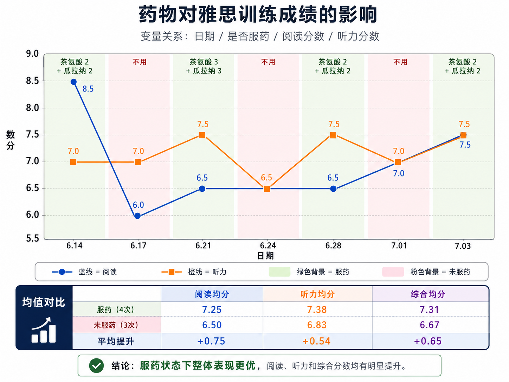

# 邪修提升专注力：茶氨酸与咖啡因在雅思场景中的个人观察

> **摘要**：我记录了 7 次雅思听力与阅读训练，其中 4 次服用茶氨酸与咖啡因组合，3 次未服用。最后一次是真实考试的场景。服用组的听力、阅读均分分别比未服用组高 0.54 和 0.75 分，两科合并均分高 0.65 分。这个结果说明组合的使用与更高成绩同时出现，但由于样本只有 1 人，且没有随机、盲法和安慰剂控制，不能证明它直接提高了雅思成绩。

## 一、结论先行

茶氨酸与咖啡因组合可能在短时间内改善警觉性和注意控制，从而帮助我在雅思听力与阅读这类持续用脑任务中保持状态。已有随机对照研究也观察到该组合对部分注意任务的反应速度或准确率有小幅改善，但效果取决于任务和测试时间，并不稳定覆盖所有指标。

因此，更准确的表述是：**该组合可能减少疲劳和注意波动，间接帮助发挥已有能力；它不是提分药，也不能替代语言基础、睡眠和训练。**

## 二、组合与实验方法

### 1. 使用方案

- 茶氨酸：每次约 200 mg，选择常见正规品牌。
- 咖啡因：目标量约 100 mg，使茶氨酸与咖啡因约为 2:1。
- 咖啡因来源：Swanson 瓜拉纳胶囊，一种含天然咖啡因的植物提取物。
- 测试任务：雅思听力和阅读模拟训练。

需要注意，瓜拉纳原料的咖啡因含量可能存在批次差异，**胶囊数量不能直接换算为准确的咖啡因剂量**。如果要提高实验可重复性，应以产品标签标注的咖啡因毫克数为准，而不是只记录“几粒”。

### 2. 记录设计

实验分为日常测试和真实考试准备两个阶段。7 次记录中有 4 次服用组合、3 次不服用，后者构成对照。每次完成同类型的雅思听力和阅读任务，并记录成绩。

| 日期 | 条件 | 茶氨酸 | 瓜拉纳 | 阅读 | 听力 |
| --- | --- | ---: | ---: | ---: | ---: |
| 06.14 | 服用 | 2 粒 | 2 粒 | 8.5 | 7.0 |
| 06.17 | 未服用 | 0 | 0 | 6.0 | 7.0 |
| 06.21 | 服用 | 3 粒 | 3 粒 | 6.5 | 7.5 |
| 06.24 | 未服用 | 0 | 0 | 6.5 | 6.5 |
| 06.28 | 服用 | 2 粒 | 2 粒 | 6.5 | 7.5 |
| 07.01 | 未服用 | 0 | 0 | 7.0 | 7.0 |
| 07.03（真实考试） | 服用 | 2 粒 | 2 粒 | 7.5 | 7.5 |

## 三、结果

| 指标 | 服用组（4 次） | 未服用组（3 次） | 均值差 |
| --- | ---: | ---: | ---: |
| 阅读 | 7.25 | 6.50 | +0.75 |
| 听力 | 7.38 | 6.83 | +0.54 |
| 两科合并 | 7.31 | 6.67 | +0.65 |

7 次记录中，服用组的两科均值均高于未服用组。阅读的差异更明显，听力的波动相对较小。图中也保留了每次测试的原始分数，避免只看均值而忽略单次差异。

不过，数据不能排除以下解释：不同套题难度不同；训练本身带来进步；睡眠、情绪和测试时间没有控制；我知道自己是否服用，可能产生期待效应；样本量过小，单次高分会明显改变均值。因此，图表反映的是**相关性和个人体验**，不是因果结论。

## 四、为什么可能有效

咖啡因通过阻断腺苷受体提高警觉性，通常能减轻困倦，但也可能引起紧张、心率加快和注意过度集中。茶氨酸是茶叶中的氨基酸，部分研究认为它可能缓和咖啡因带来的主观紧张，并改善某些注意控制指标。两者组合的目标不是让人“更兴奋”，而是让清醒状态更平稳。

已有证据与这一解释基本一致：

| 研究 | 设计与剂量 | 主要结果 |
| --- | --- | --- |
| Haskell 等，2008 | 随机双盲交叉；茶氨酸 250 mg + 咖啡因 150 mg | 部分反应速度、工作记忆和疲劳指标改善 |
| Giesbrecht 等，2010 | 44 人交叉试验；茶氨酸 97 mg + 咖啡因 40 mg | 在高注意需求任务中更容易维持专注 |
| Einöther 等，2010 | 随机双盲交叉；茶氨酸 97 mg + 咖啡因 40 mg | 任务切换表现改善，但并非所有注意指标都改善 |
| Williams 等，2025 | 系统综述与荟萃分析 | 对部分注意任务有小到中等的急性收益，结果受任务和时间影响 |

这些研究测量的是实验室认知任务，不是雅思分数。因此，只能说明组合具备帮助注意表现的可能性，不能据此推断固定的提分幅度。

## 五、安全边界

1. 不要在正式考试当天第一次尝试。应先在同时间、同强度的模拟测试中确认身体反应。
2. 咖啡因可能引起失眠、焦虑、心悸、胃部不适和手抖；对咖啡因敏感的人应降低剂量或避免使用。
3. 美国 FDA 提到，多数健康成年人每日 400 mg 咖啡因通常不与负面影响相关，但个体差异很大。这是安全参考上限，不是建议剂量。
4. 避免纯咖啡因粉或高浓度液体。它们难以准确计量，过量可造成严重伤害。
5. 孕期、心血管疾病、焦虑或睡眠障碍患者，以及正在服药的人，应先咨询医生。补充剂也不能视为完全无风险。

## 六、如何做出更可靠的个人验证

如果要继续测试，应尽量固定题目来源、测试时间、睡眠时长和饮食，并提前随机安排“服用日”和“对照日”。记录实际毫克数、主观专注度、不良反应和成绩，至少积累更多重复数据。条件允许时可使用外观一致的安慰剂并让第三方编码，减少期待效应。

对我而言，这 7 次记录支持继续谨慎观察，但不足以宣称组合一定提分。真正稳定的收益仍来自语言能力、限时训练和睡眠；茶氨酸与咖啡因最多只是帮助状态接近正常上限。

## 参考资料

1. [Haskell CF, et al. The effects of L-theanine, caffeine and their combination on cognition and mood. *Biological Psychology*. 2008.](https://pubmed.ncbi.nlm.nih.gov/18006208/)
2. [Giesbrecht T, et al. The combination of L-theanine and caffeine improves cognitive performance and increases subjective alertness. *Nutritional Neuroscience*. 2010.](https://pubmed.ncbi.nlm.nih.gov/21040626/)
3. [Einöther SJL, et al. Effects of L-theanine and caffeine on attention and task switching. *Appetite*. 2010.](https://pubmed.ncbi.nlm.nih.gov/20079786/)
4. [Williams JL, et al. The Cognitive Effects of L-Theanine and Caffeine: A Systematic Review and Meta-Analysis. 2025.](https://pubmed.ncbi.nlm.nih.gov/40314930/)
5. [U.S. Food and Drug Administration. Spilling the Beans: How Much Caffeine is Too Much?](https://www.fda.gov/consumers/consumer-updates/spilling-beans-how-much-caffeine-too-much)
